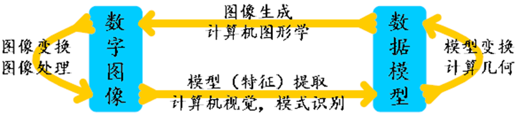
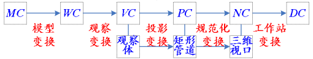

# 计算机图形图像技术复习资料

## 前言

1. 改编自：https://blog.csdn.net/Liu_Xin233/article/details/135232531
2. ★重点，※补充
3. [github](https://github.com/3210448723/ComputerGraphicsAndImageTechnologyCourse)

 考试题型
---------------------------------------------------------------------

1. 简述题（10分×4题，共40分）

   1. 第1章的基本内容
   2. 三维观察流水线中的基本概念与理解
   3. 三维场景真实感绘制中的基本概念与理解
   4. 图像增强中的基本概念与理解
   5. 形态学操作，包括膨胀，腐蚀，开，闭等操作中的基本概念与理解

2. 计算题（共10分）

   Bézier样条的计算表达

3. 编程题（共30分）

   > 好好做实验题，但没有书上和习题的原题

   1. OpenCV基本函数的调用
   2. 利用OpenGL编写核心代码，包括平移，旋转，缩放及坐标系之间的变换等所有其它的基本变换。
   3. 利用OpenCV编写核心代码，内容包括图像增强，图像分析等

4. 问答题（共20分）

   > 第一章和第十章内容，考得宽泛，无需写具体知识点，但回答尽量多写字数

   1. 计算机图形学和数字图像处理这两门学科的关系
   2. 图像处理有哪些细分领域，与自己有什么关系

第1章 计算机图形学概述
------------

>简述题或者最后的问答题

### 一、计算机图像学定义★

是研究怎样利用计算机**表示**、**生成**、**处理**和**显示**图形的**原理、算法、方法和技术**的一门学科（计算机图形学=造型+绘制）。

### 二、图形的构成要素

*   几何要素

    刻画形状的点、线、面、体等。

*   非几何要素

    反映物体表面属性和材质的灰度、颜色等。

> 方程x+y=1确定的图形由满足这个方程并具有一定颜色信息的点构成。

### 三、图形的表示方法★

> 要具体展开说明分别是什么

#### [1](https://blog.csdn.net/Liu_Xin233/article/details/135232531)、参数法

用图形的**形状参数**和**属性参数**来表示图形。

*   形状参数
    *   描述图形的方程
    *   分析表达式的系数
    *   线段的端点坐标
    *   多边形的顶点坐标等

*   属性参数
    *   颜色
    *   线型等


> 参数法描述的图形叫做**参数图**或简称为**图形**。

#### [2](https://blog.csdn.net/Liu_Xin233/article/details/135232531)、点阵法

通过**列出图形中所有的点**来表示图形。点阵法强调的是：

*   图形由哪些点组成。
*   每个点具有怎样的颜色。

> 点阵法描述的图形叫做**像素图**或**图像**。

### 四、计算机图形学的研究内容★

#### [1](https://blog.csdn.net/Liu_Xin233/article/details/135232531)、图形的输入

如何开发和利用**图形输入设备及相关软件**把图形输入到计算机中，以便进行各种处理。

#### [2](https://blog.csdn.net/Liu_Xin233/article/details/135232531)、图形的处理

包括对图形进行**变换**（如几何变换、投影变换）和**运算**（如图形的并、交、差运算）等处理。

#### [3](https://blog.csdn.net/Liu_Xin233/article/details/135232531)、图形的生成和输出

如何将图形的特定表示形式**转换**成图形输出系统便于接受的表示形式，并将图形在显示器或打印机等输出设备上输出。

### 五、计算机图形学与相关学科的关系★

> 图形学、数字图像处理、相关学科之间的关系，分别研究什么，在相关学科中处于什么位置（1.1节）



*   **计算机图形学**着重讨论怎样将数据模型变成数字图像。
*   **图像处理**着重研究图像的**压缩存储**和**去除噪音**等问题，以**突出**图像中感兴趣的部分或特征。
*   **模式识别**重点讨论如何从图像中提取数据和模型。
*   **计算几何**着重研究数据模型的**建立、存储和管理**

### 六、计算机图形学的部分应用领域※

> 此部分可能出问答题，囿于篇幅，此处不详细展开，详细内容请移步教材P2-P3

*   计算机辅助设计（CAD）与制造
*   科学计算可视化
*   虚拟现实（VR）
*   计算机艺术
*   计算机动画（CG）
*   图形用户接口（GUI）

## 第2-3章

不会考具体的知识点，主要通过编程题体现

## 第4章 二维图形变换

为第5章铺垫，不考

第5章 三维图形变换
----------

> 看明白程序片段，只需写核心OpenGL代码（注意顺序），不需要写矩阵的数学变换步骤，在编程题中考察

### 一、三维基本变换

#### [1](https://blog.csdn.net/Liu_Xin233/article/details/135232531)、平移

用T(tx,ty,tz)表示。

*   glTranslatef(tx, ty, tz)
*   glTranslated(tx, ty, tz)

#### [2](https://blog.csdn.net/Liu_Xin233/article/details/135232531)、缩放

用S(sx,sy,sz)表示。

*   glScalef(sx, sy, sz)
*   glScaled(sx, sy, sz)

#### [3](https://blog.csdn.net/Liu_Xin233/article/details/135232531)、旋转

分别用Rx(θ)、Ry(θ)和Rz(θ)表示绕x轴、y轴和z轴的旋转。

*   glRotatef(th, x, y, z)
*   glRotated(th, x, y, z)

表示绕旋转轴(0,0,0)—(x,y,z)旋转th角度。

*   (x,y,z)—(1,0,0)表示旋转轴为x轴
*   (x,y,z)—(0,1,0)表示旋转轴为y轴
*   (x,y,z)—(0,0,1)表示旋转轴为z轴

### 二、三维变换的复合★

#### [1](https://blog.csdn.net/Liu_Xin233/article/details/135232531)、通用三维旋转

##### [（](https://blog.csdn.net/Liu_Xin233/article/details/135232531)1）问题

已知P~0~={x~0~,y~0~,z~0~}，P~1~={x~1~,y~1~,z~1~}，旋转轴为P~0~P~1~，旋转角为θ。求该旋转变换的变换矩阵。

##### [（](https://blog.csdn.net/Liu_Xin233/article/details/135232531)2）程序片段

```c++
glTranslated(x0, y0, z0);   // (5) 使旋转轴回到原来的位置
glMultMatrixd((const double[]){ // (4) 使旋转轴回到原来的方向
    u1, u2, u3, 0,
    v1, v2, v3, 0,
    n1, n2, n3, 0,
    0, 0, 0, 1
});
glRotated(th, 0, 0, 1); // (3) 绕坐标轴Z完成指定的旋转（th=θ）
glMultMatrixd((const double[]){ // (2) 使旋转轴与某坐标轴重合
    u1, v1, n1, 0,
    u2, v2, n2, 0,
    u3, v3, n3, 0,
    0, 0, 0, 1
});
glTranslated(-x0, -y0, -z0);    // (1) 使旋转轴通过坐标原点
```

#### [2](https://blog.csdn.net/Liu_Xin233/article/details/135232531)、通用反射轴反射

##### [（](https://blog.csdn.net/Liu_Xin233/article/details/135232531)1）问题

已知反射轴为P0P1，P0={x0,y0,z0}，P1={x1,y1,z1}。求该反射变换的变换矩阵。

##### [（](https://blog.csdn.net/Liu_Xin233/article/details/135232531)2）程序片段

```c++
glTranslated(x0, y0, z0);       // (5) 使反射轴回到原来的位置
glMultMatrixd((const double[]){ // (4) 使反射轴回到原来的方向
    u1, u2, u3, 0,
    v1, v2, v3, 0,
    n1, n2, n3, 0,
    0, 0, 0, 1
});
glScaled(-1, -1, 1);    // (3) 关于坐标轴完成指定的反射（关于Z轴反射）
glMultMatrixd((const double[]){ // (2) 使反射轴与某坐标轴重合（Z轴）
    u1, v1, n1, 0,
    u2, v2, n2, 0,
    u3, v3, n3, 0,
    0, 0, 0, 1
});
glTranslated(-x0, -y0, -z0);    // (1) 使反射轴通过坐标原点
```

#### [3](https://blog.csdn.net/Liu_Xin233/article/details/135232531)、通用反射面反射

##### [（](https://blog.csdn.net/Liu_Xin233/article/details/135232531)1）问题

已知反射面的方程为ax+by+cz+d=0 ，且点(x0,y0,z0)在反射面上。求该反射变换的变换矩阵。

##### [（2](https://blog.csdn.net/Liu_Xin233/article/details/135232531)）程序片段

```c++
glTranslated(x0, y0, z0);       // (5) 使反射面回到原来的位置
glMultMatrixd((const double[]){ // (4) 使反射面回到原来的方向
    u1, u2, u3, 0,
    v1, v2, v3, 0,
    n1, n2, n3, 0,
    0, 0, 0, 1
});
glScaled(1, 1, -1);     // (3) 关于坐标平面完成指定的反射（XY平面）
glMultMatrixd((const double[]){ // (2) 使反射面与某坐标平面重合（XY平面）
    u1, v1, n1, 0,
    u2, v2, n2, 0,
    u3, v3, n3, 0,
    0, 0, 0, 1
});
glTranslated(-x0, -y0, -z0);    // (1) 使反射面通过坐标原点
```

### 三、三维观察流水线★

> 基础概念和理解。没有详细说怎么考，也没有往年试题参考，只能自己猜了



#### 模型变换

##### 概念

从模型坐标系到世界坐标系的变换。

> 3D建模之初，模型有自己的坐标系，以及相应的点坐标。如果放到一个世界坐标系中，需要将它自身的坐标点全部移动到给定位置。

##### 方法

首先构造从世界坐标系到模型坐标系的变换，然后计算该变换的逆变换。（M = (RT)^-1^ =  T^-1^R^-1^）

1. 使模型坐标系的原点与世界坐标系的原点重合
2. 使模型坐标系的坐标轴与世界坐标系的坐标轴重合
3. 计算上述2个变换复合以后的逆变换。

#### 观察变换

##### 概念

世界坐标系→观察坐标系

##### 方法

1. 将观察参考点P~0~平移到世界坐标原点
2. 使 x~v~, y~v~, z~v~ 轴（观察坐标系）与 x~w~, y~w~, z~w~ 轴（世界坐标系）重合

#### 投影变换

##### 概念

观察坐标系→投影坐标系

> 将三维场景投影到二维平面上。

##### 分类

1. 平行投影
   1. 正投影
   2. 斜投影
2. 透视投影

#### 规范化变换

##### 概念

投影坐标系→规范化坐标系

> 将坐标值缩放到一定的范围，比如[-1, 1]或[0, 1]。

##### 观察体的变化


* 矩形管道变换为规范化观察体。
* 矩形管道中的点（ PC ）变换为三维视口中的点（ NC ）。
* 三维视口范围不超过规范化观察体范围。

#### 工作站变换

##### 概念

规范化坐标系→屏幕/设备坐标系

> 将规范化坐标映射到屏幕或设备坐标系，通常包括缩放和平移等操作，以适应实际显示设备的尺寸和位置。

第7章 三维场景的真实感绘制★
--------------

### 一、可见面判别算法★

可见面判别算法/隐藏面消除算法用于判断场景中各个面片的**可见性**

#### [1](https://blog.csdn.net/Liu_Xin233/article/details/135232531)、分类

*   物空间算法

    将场景中各**物体**和各**组成部分**相互进行比较，以判别哪些面可见。

*   像空间算法

    在投影平面上**逐点判断**各像素对应的可见面。

#### [2](https://blog.csdn.net/Liu_Xin233/article/details/135232531)、常用算法

*   物空间算法
    *   后向面判别算法

*   像空间算法
    *   深度缓冲器算法（也叫 z-buffer算法，OpenGL和MATLAB使用了该算法）
    *   扫描线算法
    *   深度排序算法（也叫画家算法，Matlab使用了该算法）


### 二、光照模型与面绘制算法

*   光照模型（也称明暗模型）

    用于物体表面某点处的光强度计算。

*   面绘制算法（也称渲染算法）

    通过光照模型中的光强度计算，确定场景中物体表面所有投影像素点的光强度。

第9章 样条方法（Bézier样条）★
------------------

> 计算题

### 一、Bézier基函数

#### 1、定义（表达式）


#### 2、特性


### 二、三次Bézier曲线

#### 1、基函数


#### 2、矩阵形式


#### 3、例题


第10章 数字图像处理概述
-------------

> 问答题。此章老师说结合课程PPT和另外发的补充PPT复习，没有给出明确考点，因此将一些基本知识点整合至此。

### 研究对象

数字图像

### 数字图像

#### [1](https://blog.csdn.net/Liu_Xin233/article/details/135232531)、含义

凡是记录在纸上，拍摄在照片上，显示在屏幕上的所有具有视觉效果的画面都可以称为图像。

#### [2](https://blog.csdn.net/Liu_Xin233/article/details/135232531)、图像的灰度信息

图像的灰度信息是指图像中各点处的**颜色深浅**程度信息（也就是**明暗程度**信息或**亮度**信息）。

*   对于灰度图像来说，灰度就是黑白程度等级（也就是明暗程度等级或亮度）；
*   对于彩色图像来说，情况也一样，因为任何彩色图像都可以分解成红、绿、蓝三种灰度图像，因此彩色图像的灰度指的是这三种灰度图像的灰度。

#### [3](https://blog.csdn.net/Liu_Xin233/article/details/135232531)、分类

1. 视觉特点

   1. 可见图像
   2. 不可见图像

2. 图像记录方式

   1. 模拟图像

      通过某种物理量（光、电）的强弱变化来记录图像上各点的灰度信息（如模拟相机和模拟电视等）。

   2. 数字图像

      用数值记录图像的灰度信息。数字图像比模拟图像更容易保存，不会因为保存时间过长而失真。

#### 4、基本类型

1. 黑白图像/二值图像

   指图像的每个像素只能是黑或者白，没有中间的过渡。二值图像的像素值为0、1。

2. 灰度图像

   指各像素信息由一个量化的灰度级来描述的图像，没有彩色信息。灰度取值范围为\[0（黑）～255（白）\]。

3. 索引图像/映射图像

   包括存放图像数据的二维矩阵和颜色索引矩阵（MAP）。

4. 彩色图像

   指每个像素的信息由RGB三原色构成的图像，其中R、G、B是由不同的灰度级来描述的。

### 数字图像处理

#### 定义

利用计算机对图像进行去除噪声、 增强、 复原、分割、提取特征等的理论、方法和技术

> 数字图像处理（Digital Image Processing）通常是用计算机和实时硬件实现的，因此也称之为计算机图像处理(Computer Image Processing）。

#### 特点

*   处理精度高，再现性好
*   处理方法的多样性
*   图像数据量庞大
*   处理费时
*   图像处理技术综合性强

#### 研究内容

*   图像数字化。

    研究如何把一幅连续的光学图像表示成一组数值，既不失真又便于计算机分析处理。

*   图像增强。

    增强图像中的有用信息，削弱干扰和噪音，以便于观察、识别和进一步分析、处理。增强后的图像不一定和原图像一致。

*   图像恢复。

    使褪色或模糊的图像复原。复原的图像要尽可能和原图像保持一致。

*   图像编码。

    在满足指定保真度的前提下，简化图像的表示，压缩表示图像的数据，便于存储和传输。

*   图像分析。

    对图像中的各种对象进行分割、分类、识别、描述、解释等。

#### 部分应用领域★

*   航空和航天领域
    *   登月、火星照片处理
    *   飞机遥感、卫星遥感
    *   气象预报

*   生物和医学领域
    *   CT、MRI（核磁共振）、B超
    *   显微图像：红细胞、白细胞、染色体的分析
    *   X光、心电图

*   军事和公安领域
    *   导弹制导
    *   侦察照片的处理
    *   指纹识别、人脸识别

*   工业和工程领域
    *   印刷电路板
    *   机器人视觉
    *   零件检测
    *   邮政信件的自动检测

*   通信领域
    *   多媒体通讯：数字电视、高清析度电视 (HDTV)、多媒体信息处理，可视电话、会议电视等。
    *   电话、电视、计算机三网合一

*   电子商务与文化艺术领域
    *   电视画面的数字编辑
    *   动画制作
    *   游戏
    *   纺织工艺品设计
    *   发型设计
    *   文物资料图片的修复


### 图像数据

#### [1](https://blog.csdn.net/Liu_Xin233/article/details/135232531)、图像在计算机上的存在形式

数字图像在计算机上是以位图形式存在的。位图是一个矩形点阵，每一个点都称为一个像素。像素是数字图像中的基本单位。一幅W×H大小的图像，是由W×H个明暗不等的像素组成的。

*   在数字图像中，各像素的明暗程度由一个称为灰度值的数值标识（白：255，黑：0），描述一个像素需要用8位二进制数据。
*   在灰度图像中，每个图像中的像素都分别由1字节记录。
*   在彩色图像中，每个像素需用3字节（用红、绿、蓝三个灰度图像混合出所有颜色）数据记录。

#### 2、BMP文件格式

基于调色板的BMP文件由文件头、信息头、调色板和图像的像素数据四个部分组成，而真彩色的BMP文件则由文件头、信息头和图像的BGR像素数据组成。


*   文件头是一个BITMAPFILEHEADER数据结构，共14字节。
*   信息头是一个BITMAPINFOHEADER数据结构，包含与设备无关的点阵位图的尺寸和颜色格式等信息，共40字节。
*   调色板也叫颜色表，是一个可变长的列表，列表的长度由信息头中的biBitCount值决定（2^biBitCount^）。调色板中的每一项是一个RGBQUAD对象，共4字节。
*   BMP图像像素数据的存储顺序是由下往上，从左往右。像素数据的每一行都必须是4字节对齐的，即每一行像素数据的长度（单位为字节）都必须是4的倍数，如果不是4的倍数则必须补足。真彩色图像没有调色板，像素数据直接使用BGR颜色值。

## 第11-12章

不会考具体的知识点，基本函数要会写，会考核心代码，主要通过编程题体现

第13章 图像变换
---------

> 这章老师说不明确考，也没有明确考点，因此根据基本概念和平时作业补充资料，仅供参考。

### 定义

对图像的像素位置或像素值进行的某种变换。

### 主要内容

*   对像素位置的变换。

    逐一计算每个像素的新位置，用于改变像素的位置、图像的大小和形状等，通常使用图像的仿射变换和透视变换实现。

*   对单一像素值的变换。

    每个新像素值都通过对应的单一源像素值获得，通常使用图像的线性变换实现。

*   对像素块的变换。

    每个新像素值都通过对应的源像素块获得，通常使用图像的空域滤波和频域滤波等变换实现。

### 空间转换的常见种类

*   空域与空域的转换

    常见的是颜色空间转换，使用线性变换实现。

*   空域与频域的转换

    通常使用离散傅立叶变换或离散余弦变换等方法实现。

### 二维离散傅立叶变换


### 例题

1、计算对下列实数矩阵进行傅立叶正变换后的变换结果（不缩放结果）。


2、计算对下列实数矩阵进行傅立叶逆变换后的变换结果（缩放结果，i为虚数单位）。

> 此题给出个人答案，仅供参考，如有错误请联系指正（确信）


第14章 图像增强★
---------

> 简答题

### 定义

图像增强是图像处理的**基础**，它是对图像施加的某种**数学变换**，其目的通常是为了除去图像中的**噪音**，强调或抽取图像的**轮廓特征**等。

### 图像中的噪音

指在图像生成、保存和传递过程中由外部干扰在图像中加入的**冗余信息**。

> 例如，电视画面上常见的雪花点就是一种典型的噪音。

### 图像增强的两类基本技术

*   直接对像素的灰度值进行演算的灰度空间变换
*   对图像的频谱域（可以通过傅立叶变换等变换得到）进行变换的频谱变换技术

### 图像平滑处理方法

#### [1](https://blog.csdn.net/Liu_Xin233/article/details/135232531)、概念

平滑处理是一种简单且使用频率很高的图像处理方法，是除去图像中点状噪音的一个有效方法。

平滑化是指使图像上任何一个像素与其相邻像素的灰度值的大小不会出现陡变的一种处理方法。

这种处理会使得图像变模糊，所以图像的平滑化也称为图像的模糊化。

#### [2](https://blog.csdn.net/Liu_Xin233/article/details/135232531)、分类★

> 概念，编程题

##### [（](https://blog.csdn.net/Liu_Xin233/article/details/135232531)1）归一化块滤波器

特点是**模板系数之和为1**。

模板系数全相同的归一化块滤波器称为均值模糊器或简单模糊器，是最简单的滤波器。

##### [（](https://blog.csdn.net/Liu_Xin233/article/details/135232531)2）高斯滤波器

> 最常用

是一种通过**指定参数计算模板系数**的归一化块滤波器

是最有用的滤波器（尽管不是最快的）。

##### [（](https://blog.csdn.net/Liu_Xin233/article/details/135232531)3）中值滤波

> 不光简答题可能出，编程题也可能体现

中值滤波是一种**非线性**处理技术，可用来抑制图像中的**噪音**，而且保持轮廓的清晰。

中值滤波使用当前像素近旁nx×ny个像素的灰度值的中值（不是平均值）作为当前像素的新灰度值。

> 中值滤波具有不损失有效信息的优点。

### OpenCV中的平滑处理

> 掌握函数，编程题

#### [1](https://blog.csdn.net/Liu_Xin233/article/details/135232531)、均值模糊

【函数原型】

void blur(InputArray src, OutputArray dst, Size ksize);

【参数】

*   src：输入图像。
*   dst：输出图像，大小和类型与源图像一致，必要时重建。
*   ksize：内核大小，必须是正奇数。

#### [2](https://blog.csdn.net/Liu_Xin233/article/details/135232531)、中值模糊

【函数原型】void median(BlurInputArray src, OutputArray dst, int ksize);

【参数】

*   src：输入图像。
*   dst：输出图像，大小和类型与源图像一致，必要时重建。
*   ksize：内核大小，必须是正奇数。

#### [3](https://blog.csdn.net/Liu_Xin233/article/details/135232531)、高斯模糊

【函数原型】void GaussianBlur(InputArray src,OutputArray dst,Size ksize, double sigmaX, double sigmaY=0);

【参数】

*   src：输入图像。
*   dst：输出图像，大小和类型与源图像一致，必要时重建。
*   ksize：内核大小，必须是正奇数。
*   sigmaX和sigmaY：高斯内核中变量x和y的标准差σ1和σ2 。

【说明】如果sigmaY=0，则使用sigmaY=sigmaX。如果标准差都是0，则使用公式σ=0.3(0.5n-1)+0.8由内核尺寸计算标准差。

#### [4](https://blog.csdn.net/Liu_Xin233/article/details/135232531)、代码演示

对一幅含有噪音的灰度图像进行简单模糊、中值模糊和高斯模糊：

```c++
#include<opencv2/opencv.hpp>
using namespace cv;
int main() {
    Mat X = imread("lena-n.jpg", 0);    // 含噪声的灰度图像
    if(X.empty())
		return -1;
    imshow("源图像", X);
    Mat Y;      // 结果图像
    blur(X, Y, {5, 5}); // 简单模糊
    imshow("简单模糊", Y);
    medianBlur(X, Y, 5);// 中值模糊
    imshow("中值模糊", Y);
    GaussianBlur(X, Y, {5, 5}, 0, 0);   // 高斯模糊, 标准差都是0
    imshow("高斯模糊", Y);
    waitKey();
}
```

### 图像锐化处理方法★

> 概念，简述题

#### 主要目的

* 突出图像中的细节或者增强被模糊化了的**细节**
* 被用于景物**边界**的检测与提取，把景物的结构**轮廓**清晰地表现出来。

#### 效果

* 增强**轮廓线条**。
* 轮廓线以外的部分将变得较暗，而轮廓线部分将变得比较**明亮**。

#### 方向模板★

用于在图像中抽出**某一特定方向**的轮廓线。

根据所需的方向，可从下列8种模板中选取合适的模板。


### 形态学操作★

> 简答题

#### 定义

* 是一种**非线性**处理技术。
* **是基于形状**的一系列图像处理操作。
* 通过将**结构元素**作用于输入图像来产生输出图像。
* 结构元素就是矩形、椭圆等形状的模板，可以通过分别将形状部分的模板系数指定为1，其余部分的模板系数指定为0实现。

#### 效果

*   消除噪音。
*   分割独立的图像元素，以及连接相邻的元素。
*   寻找图像中明显的极大值区域或极小值区域。

#### 常用操作★

> 概念、操作、功能、效果

##### [（1](https://blog.csdn.net/Liu_Xin233/article/details/135232531)）腐蚀

*   腐蚀提取内核覆盖区域中的**最小**像素值。
*   进行腐蚀操作时，将内核滑过图像，用内核覆盖区域中的**最小**像素值代替锚点位置的像素。
*   这一最小化操作会导致图像的亮区“**缩小**”。

##### [（2](https://blog.csdn.net/Liu_Xin233/article/details/135232531)）膨胀

*   膨胀提取内核覆盖区域中的**最大**像素值。
*   进行膨胀操作时，将内核滑过图像，用内核覆盖区域中的**最大**像素值代替锚点位置的像素。
*   这一最大化操作会导致图像的亮区“**扩展**”。

##### [（](https://blog.csdn.net/Liu_Xin233/article/details/135232531)3）开运算

* **先腐蚀再膨胀**，用于在图像中消除小的物体。
* 在纤细点处分离物体，在将较大物体的边界平滑化的同时不明显改变物体的体积。

##### [（](https://blog.csdn.net/Liu_Xin233/article/details/135232531)4）闭运算

* **先膨胀再腐蚀**
* 能够排除小型黑洞，消除小块噪音区域，连接邻近区域。

>此外还有3种高级形态学操作（形态学梯度、顶帽、黑帽）可以根据情况看教材了解。

### 图像的频谱变换

> 编程题可能会用到

#### [1](https://blog.csdn.net/Liu_Xin233/article/details/135232531)、低通频域滤波

对低通滤波器来说，H(u,v)应该对高频成分有衰减作用而又不影响低频分量。通常使用低通滤波器实现图像平滑，滤除噪音。

##### [（](https://blog.csdn.net/Liu_Xin233/article/details/135232531)1）理想低通滤波器

过滤了高频成分，高频成分的滤除使图像变模糊，但过滤后的图像往往含有“抖动”或“振铃”现象。

> “振铃”：指输出图像的灰度剧烈变化处产生的震荡，就好像钟被敲击后产生的空气震荡。

##### [（](https://blog.csdn.net/Liu_Xin233/article/details/135232531)2）巴特沃斯（ButterWorth）低通滤波器

与理想低通滤波器相比，经ButterWorth低通滤波器处理的图像模糊程度会大大减少，并且过滤后的图像没有“抖动”或“振铃”现象。

##### [（](https://blog.csdn.net/Liu_Xin233/article/details/135232531)3）指数低通滤波器

平滑效果与ButterWorth低通滤波器大致相同。

#### [2](https://blog.csdn.net/Liu_Xin233/article/details/135232531)、高通频域滤波

高通频域滤波是加强高频成分的方法，它使高频成分相对突出，低频成分相对抑制，从而实现图像锐化。常用于提升图像的边缘和轮廓等特征。

##### [（](https://blog.csdn.net/Liu_Xin233/article/details/135232531)1）理想高通滤波器

理想高通滤波器只保留了高频成分。

##### [（2](https://blog.csdn.net/Liu_Xin233/article/details/135232531)）巴特沃斯（ButterWorth）高通滤波器

与理想高通滤波器相比，经ButterWorth高通滤波器处理的图像会更平滑。

##### [（3](https://blog.csdn.net/Liu_Xin233/article/details/135232531)）指数高通滤波器

指数高通滤波器的锐化效果与ButterWorth高通滤波器大致相同。

#### 3、应用举例

（1）使用ButterWorth低通滤波对一幅含噪音的灰度图像进行平滑操作

```c++
#include "cvv.hpp"
using namespace cv;
int main() {
    Mat X = imread("lena-n.jpg", 0);   // 含噪声的灰度图像
    if(X.empty())
		return -1;
    imshow("源图像", X);
    filter_dft(X, X, 25, BUTTER_L);    // ButterWorth低通滤波
    normalize(X, X, 255, 0, NORM_INF); // 增大亮度以便于观察
    imshow("结果图像", X);
    waitKey();
}
```

（2）使用ButterWorth高通滤波对一幅灰度图像进行锐化操作

```c++
#include "cvv.hpp"
using namespace cv;
int main() {
    Mat X = imread("lena.jpg", 0);     // 灰度图像
    if(X.empty())
		return -1;
    imshow("源图像", X);
    filter_dft(X, X, 60, BUTTER_H);    // ButterWorth高通滤波
    normalize(X, X, 255, 0, NORM_INF);    // 增大亮度以便于观察
    imshow("高通滤波", X);
    waitKey();
}
```

第15章 图像解析
---------

> 了解直方图的计算和作用并用程序表达

### 一、灰度直方图

* 建立灰度直方图是对图像的灰度分布进行分析的重要手段。
* 灰度直方图是灰度级的函数，它表示图像中具有某种灰度级的像素的个数，反映了图像中某种灰度出现的频率。
* 灰度直方图是对图像的所有像素的灰度分布按灰度值的大小显示灰度值出现频度的统计图。

### 二、灰度直方图的表示

* 横轴用来表示灰度值
* 纵轴用来表示频度。
* 频度是具有某一灰度值（或属于某一子区域的灰度值）的像素在图像中出现的次数。

#### 1、灰度值的频度

假设有一幅4×4的8灰度级图像，图像数据及其灰度直方图分别如左图和右图所示：


根据图像数据，灰度值为0, 1, 2, 3, 4, 5, 6, 7的像素的频度分别是1, 2, 6, 2, 3, 1, 0, 1，因此在灰度刻度的0~7处分别作一条以该灰度值对应的频度值为长度的直线即可完成该图像的灰度直方图。

#### 2、灰度值子区间的频度

假设有一个矩阵包含一张图像的灰度值（如左图所示）：


灰度值的范围包含256个值，可以将这个范围均匀分割成若干子区域，如8个均匀子区域，即\[0,256)=\[0,32)∪\[32,64)∪...∪\[224,256)。

将灰度值范围均匀分割成若干子区域以后，统计灰度值属于每一个子区域的像素数目。

采用这一方法来统计上面的数字矩阵，可以得到如右图所示的直方图（x轴表示子区域，y轴表示属于各个子区域的像素个数）。

#### [3](https://blog.csdn.net/Liu_Xin233/article/details/135232531)、参考程序★

```c++
// 计算一个单通道图像的直方图(源图像, 直方图, 大小, 范围)
void MyCalcHist(Mat image, Mat &hist, int size, vector<float> range) {
    float a = range[0], b = range[1];      // 下界, 上界
    if(b < a) 
		swap(a, b);
    Mat1f H(1, size, 0.0); // 直方图初始值为0
    for(auto v : Mat1f(image)) {
        int i = (v - a) * size / (b - a);   // 当前像素所在子区域
           ++H(i); // 相应子区域的像素数目增加1
    }
    hist = H;  // 记录结果
}
```

补充
===================================================================================

OpenGL与OpenCV编程基础
-----------------------------------------------------------------------------------

### 一、前言

此部分为老师提到的编程题可能涉及的基础部分知识，定位为教材第2、3、11、12章，具体掌握情况以大致可以完成课程实验为标准即可，故在此进行大致整理，所涉及的知识点不一定覆盖所有实际所需内容，因此具体复习参考教材和课程实验，以及涉及编程题考点的示例代码即可。

### [二、](https://blog.csdn.net/Liu_Xin233/article/details/135232531)OpenGL基本语法

#### [1](https://blog.csdn.net/Liu_Xin233/article/details/135232531)、函数名前缀

*   基本函数使用gl作为函数名的前缀，如glClearColor()
*   实用函数使用glu作为函数名的前缀，如gluOrtho2D()
*   实用工具包函数使用glut作为函数名的前缀，如glutInit()

#### [2](https://blog.csdn.net/Liu_Xin233/article/details/135232531)、常量名前缀

*   基本常量的名字以GL开头，如GL\_LINE\_LOOP
*   实用常量的名字以GLU开头，如GLU\_FILL
*   实用工具包常量的名字以GLUT\_开头，GLUT\_RGB

#### [3](https://blog.csdn.net/Liu_Xin233/article/details/135232531)、函数名后缀

一组功能相同或相近的函数的函数名使用不同的后缀以支持不同的数据类型和格式，如glEvalCoord2f()、glEvalCoord2d()和glEvalCoord2dv()等，其中2表示有2个参数，f、d分别表示参数的类型是GLfloat和GLdouble，v表示参数以向量形式出现。

#### [4](https://blog.csdn.net/Liu_Xin233/article/details/135232531)、特殊类型名

OpenGL定义了一些特殊的类型名，如GLint和GLfloat。其实就是32位C语言中的float和int等类型。

#### [5](https://blog.csdn.net/Liu_Xin233/article/details/135232531)、C源程序大致框架

```c++
// Frame.c
#include <GL/freeglut.h>
void init() { 
    /* 全局初始化。主要用于设置一些全局的状态，
    如颜色模式、窗口的初始位置和大小等。
    使用默认值时不需要定义该函数。
    */
}
void init2() { 
    /* 当前窗口初始化。主要用于设置一些与当前窗口关联的状态或开关，
    如光照处理、光源特性、深度检测和裁剪等。
    使用默认值时不需要定义该函数。
    */
}
void Reshape(int w, int h) { 
    /* 设置投影方式和观察体。主要使用
    glViewport()、glOrtho()、glFrustum()、gluPerspective()和gluOrtho2D()等。
    使用默认值时不需要定义该函数。
    */
}
void Paint() { 
    /* 使用OpenGL库函数构造对象的数学描述，
    包括点线面的位置、几何变换和光照处理等，是OpenGL的主要部分。
    */
}
int main(int argc, char *argv[]) { 
    glutInit(&argc, argv); // 初始化GLUT, 记录main()的参数
    init(); // 全局初始化, 使用默认值时不是必需的
    glutCreateWindow("窗口标题"); // 创建程序窗口，指定窗口标题
    init2(); // 当前窗口初始化, 使用默认值时不是必需的
    // 注册回调函数
    glutDisplayFunc(Paint); // 指定场景绘制函数，必需
    glutReshapeFunc(Reshape); // 指定窗口变化回调函数，缺省则使用默认值
    glutMainLoop(); // 开始循环执行OpenGL命令
}
```

### [三、基本图元定义](https://blog.csdn.net/Liu_Xin233/article/details/135232531)

#### [1](https://blog.csdn.net/Liu_Xin233/article/details/135232531)、绘图准备与结束

##### [（1](https://blog.csdn.net/Liu_Xin233/article/details/135232531)）指定背景颜色

*   【函数原型】void glClearColor(float red, float green, float blue, float alpha);
*   【功能】指定当前背景颜色。
*   【参数】red,green,blue,alpha为RGBA颜色值。
*   【说明】默认为黑色，即参数值全为0。

##### [（2](https://blog.csdn.net/Liu_Xin233/article/details/135232531)）清除缓冲区

*   【函数原型】void glClear(GLbitfield mask);
*   【功能】清除指定的缓冲区（设置为预先指定的值）。
*   【参数】标识要清除的缓冲区，使用按位或运算组合。
*   【说明】共有4个标识，最常用的标志是
    *   GL\_COLOR\_BUFFER\_BIT（颜色缓冲区，设置为背景颜色）
    *   GL\_DEPTH\_BUFFER\_BIT（深度缓冲区，设置为最远深度）

##### [（3](https://blog.csdn.net/Liu_Xin233/article/details/135232531)）结束绘图并返回

 ① glFlush()

*   【函数原型】void glFlush(void);
*   【功能】强制OpenGL命令序列在有限的时间内完成执行。

 ② glFinish()

*   【函数原型】void glFinish(void);
*   【功能】强制完成已发出的全部OpenGL命令的执行，即等到全部命令执行完毕以后才返回。
*   【说明】应尽量避免使用glFinish，以免影响性能。

#### [2](https://blog.csdn.net/Liu_Xin233/article/details/135232531)、图元定义

【函数原型】void glBegin(GLenum mode);

【功能】表示一个基本图元定义的开始。

【参数】mode可选下列符号常量。

*   GL\_POINTS：每一个顶点作为一个独立的点。
*   GL\_LINES：每一对顶点作为一条独立的线段。
*   GL\_LINE\_STRIP：顶点依次相连成一组线段。
*   GL\_LINE\_LOOP：顶点依次相连成一组线段，并连接末顶点与首顶点。
*   GL\_TRIANGLES：每三个顶点作为一个独立的三角形。
*   GL\_TRIANGLE\_STRIP：三角形带，顶点n、n+1和n+2定义第n个三角形。
*   GL\_TRIANGLE\_FAN：三角形扇形，顶点1、n+1和n+2定义第n个三角形。
*   GL\_QUADS：每四个顶点作为一个独立四边形。
*   GL\_QUAD\_STRIP：四边形带，顶点2n-1、2n、2n+2和2n+1定义第n个四边形。可能形成有交叉的四边形，不好把握。
*   GL\_POLYGON：所有顶点作为一个简单多边形。最好不要定义凹多边形，多边形在处理时会分解成三角形扇形，凹多边形可能得不到预期效果。

【函数原型】void glEnd(void);

【功能】表示一个基本图元定义的结束。

> 预定义的几何形体详见教材。

#### [3](https://blog.csdn.net/Liu_Xin233/article/details/135232531)、举例说明


```c++
#include <gl/freeglut.h>
void Viewport(int x, int y, // 视口左下角在程序窗口中的坐标
              int w, int h) { // 视口的宽和高
    glViewport(x, y, w, h); // 定义视口
    glLoadIdentity(); // 消除其他视口的影响, 函数介绍见后续章节
}
void Paint(){ 
    int w = glutGet(GLUT_WINDOW_WIDTH) / 2; // 计算视区宽度
    int h = glutGet(GLUT_WINDOW_HEIGHT) / 2; // 计算视区高度
    glClearColor(1, 1, 1, 1); // 白色背景
    glClear(GL_COLOR_BUFFER_BIT); // 清除颜色缓存
    Viewport(0, 0, w, h); // 左下方视口
    glColor3f(1, 0.8, 0.6); // 设置当前颜色, 茶色
    glRectf(-0.8, -0.8, 0.8, 0.8); // 定义正方形（左下角，右上角坐标）
    Viewport(w, 0, w, h); // 右下方视口
    glColor3f(0, 1, 0); // 设置当前颜色, 绿色
    glutSolidTeapot(0.6); // 定义犹他茶壶
    Viewport(0, h, w, h); // 左上方视口
    glColor3f(0, 0, 1); // 设置当前颜色, 蓝色
    glRotatef(45, 1, 1, 0); // 调整立方体方向, 函数介绍见后续章节
    glutWireCube(1); // 线框立方体, 边长为1
    Viewport(w, h, w, h); // 右上方视口
    glColor3f(1, 0, 1); // 设置当前颜色, 紫色
    glRotatef(-90, 1, 0, 0); // 调整两极方向, 函数介绍见后续章节
    glutWireSphere(0.8, 24, 12); // 线框球体, 半径, 经线数, 纬线数
    glFlush(); // 强制OpenGL命令序列在有限的时间内完成执行
}
int main(int argc, char *argv[]) { 
    glutInit(&argc, argv); // 初始化GLUT, 记录main()的参数
    glutCreateWindow("四个预定义几何形体"); // 指定窗口标题
    glutDisplayFunc(Paint); // 指定场景绘制函数
    glutMainLoop(); // 开始执行
}
```

### [四、OpenCV GUI](https://blog.csdn.net/Liu_Xin233/article/details/135232531)命令

#### 窗口管理

##### 创建窗口

*   【函数原型】void namedWindow(const string &name);
*   【功能】创建一个可以放置图像和滑块的窗口，可以通过名字引用该窗口。
*   【参数】name是窗口名字，用来区分不同的窗口，并显示为窗口标题。
*   【说明】如果已经存在这个名字的窗口，该函数不做任何事情。

##### 显示图像

*   【函数原型】void imshow(const string &name, InputArray image);
*   【功能】在指定窗口中显示图像。
*   【参数】
    *   name：窗口的名字。
    *   image：待显示的图像。
*   【说明】
    *   可显示彩色或灰度的字节图像和浮点数图像。
    *   彩色图像数据按BGR顺序存储。

#### 读写图像

##### 读入图像

* 【函数原型】Mat imread(const String &filename, int flags = IMREAD_COLOR);
* 【功能】从指定文件读入图像。
* 【参数】
  * filename：图像文件名，支持BMP、DIB、JPEG、JPG、JPE、PNG、PBM、 PGM、PPM、SR、RAS、TIFF、TIF等格式
  * flag：通常可选
    * IMREAD_UNCHANGED（等于-1，不转换载入图像）
    * IMREAD_GRAYSCALE（等于0，载入为灰度图像）
    * IMREAD_COLOR（等于1，载入为彩色图像） 
* 【说明】如果返回对象的empty()成员的调用结果为真，则表示图像文件载入失 败。

#### 输入设备

##### 响应键盘事件

*   【函数原型】int waitKey(int delay=0);
*   【功能】等待按键事件。
*   【参数】delay表示延迟的毫秒数。
*   【说明】
    *   该函数无限等待按键事件（delay<=0）或者延迟delay毫秒。
    *   该函数是HighGUI中获取和操作键盘事件的函数，在一般的事件处理中需要循环调用。
    *   返回值为按键值，如果超过指定时间则返回-1。

#### 选取矩形子集

使用()运算。

*   【函数原型】Mat operator(const Rect &roi const);
*   【功能】返回输入矩阵的矩形子集的矩阵头。
*   【参数】roi是感兴趣的矩形区域。
*   【说明】该函数返回输入矩阵中指定矩形区域对应子集的矩阵头，从而可以将输入矩阵的一个矩形子集当作一个独立矩阵处理。

##### 代码示例

```c++
// 在源图像中选取一个矩形子集，并将该矩形子集乘以0.75，然后显示图像
#include<opencv2/opencv.hpp>
using namespace cv;
int main() {
    Mat im = imread("lena.jpg", 1);   // 载入彩色图像
    if(im.empty()) 
		return -1; // 载入失败
    Mat roi = im({ 125, 125, 100, 50 });   // 选取矩形子集
    roi *= 0.75;       // 降低选取区域亮度
    imshow("SubMat", im);  // 显示图像
    waitKey();
}
```